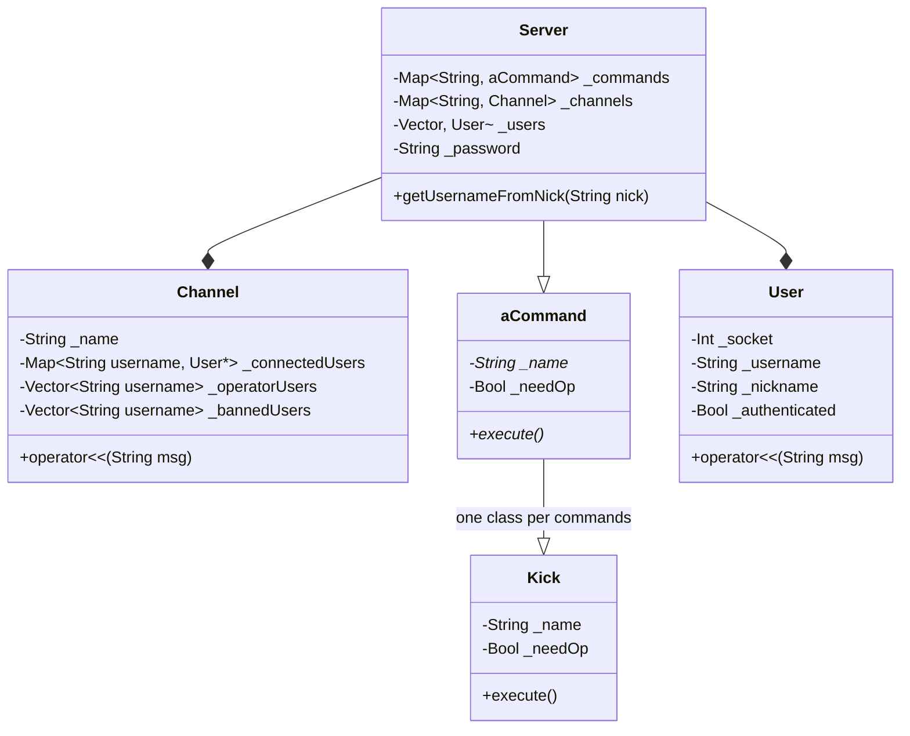

# ft_irc

```mermaid
classDiagram
    Server --* Channel
    Server --|> aCommand
    Server --* User
    Server : -Map~String, aCommand~ _commands
    Server : -Map~String, Channel~ _channels
    Server : -Vector, User~ _users
    Server : -String _password
    Server : +getUsernameFromNick(String nick)
    class Channel{
        -String _name
        -Map~String username, User*~ _connectedUsers
        -Vector~String username~ _operatorUsers
        -Vector~String username~ _bannedUsers
        +operator<<(String msg)
    }
    class aCommand{
        -String _name*
        -Bool _needOp
        +execute()*
    }
    aCommand --|> Kick:one class per commands
    class Kick{
        -String _name
        -Bool _needOp
        +execute()
    }
    class User{
        -Int _socket
        -String _username
        -String _nickname
        -Bool _authenticated
        +operator<<(String msg)
    }
```
